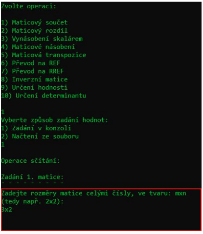

# Simple Console Matrix Calculator

Console-based matrix calculator implemented in **Python**.

The program provides an interactive CLI interface for performing common matrix
operations such as matrix multiplication, determinant calculation, row echelon
forms, and matrix inversion.

---

## Features

The calculator supports the following operations:

- Matrix addition
- Matrix subtraction
- Scalar multiplication
- Matrix multiplication
- Matrix transpose
- Row echelon form (**REF**)
- Reduced row echelon form (**RREF**)
- Matrix inverse
- Matrix rank
- Determinant

The program supports both **interactive console input** and **loading matrices from `.txt` files**.

---

## Example CLI



---

## Run

```bash
python matrix_calculator.py
```

---

## Input

Matrices can be entered in two ways:

### 1. Console input

First specify matrix dimensions in the format:

```
rows x columns
```

Example:

```
3x2
```

Then enter matrix values row by row separated by spaces.

### 2. Input from file

Matrices can also be loaded from `.txt` files.

Example file:

```
1 1 2
2 2 1
4 5 1
```

---

## Documentation

Full project documentation (Czech):

📄 [Documentation](docs/matrix_calc_doc.pdf)

---

## License

All rights reserved.

This project is publicly visible for educational purposes only.  
Use of this code requires explicit permission from the author.

---

## Author

Ondřej Kříž
